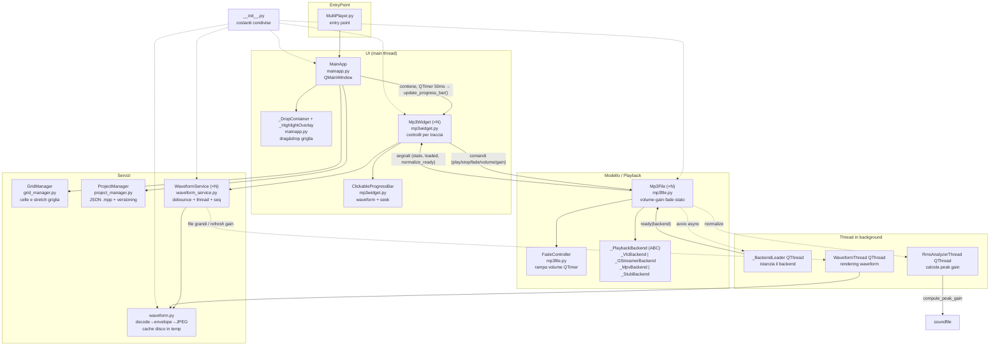
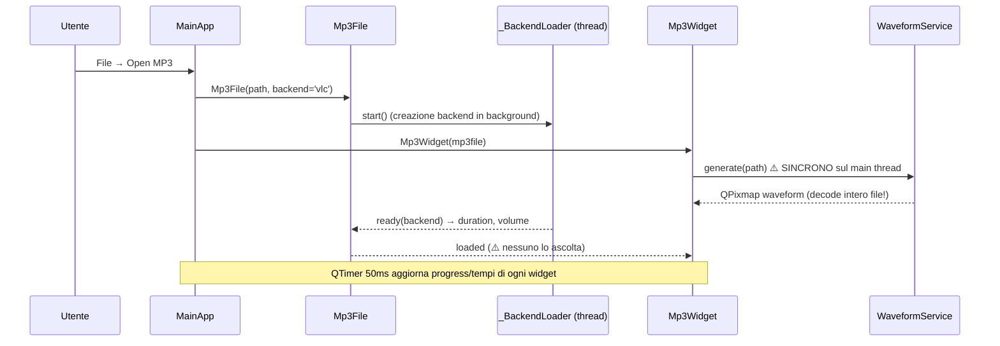

# MultiPlayer — Analisi architettura e revisione codice

> **AGGIORNAMENTO 2026-07-04:** tutti i bug (B1-B8), i probabili (P1-P4) e le
> semplificazioni proposte in questo documento sono stati **applicati**
> (vedi `tasks/todo.md` per il dettaglio). Il documento resta come fotografia
> dell'analisi pre-intervento. Note post-fix: `__init__.py` → `constants.py`,
> nuovo modulo `thread_registry.py`, `WaveformService` ora sempre asincrono
> con envelope cachato in memoria, `RmsAnalyzerThread` → `PeakAnalyzerThread`.

> Analisi basata sulla **lettura del codice** (non dei commenti), 2026-07-04.
> Moduli analizzati: `MultiPlayer.py`, `__init__.py`, `mainapp.py`, `mp3widget.py`,
> `mp3file.py`, `grid_manager.py`, `project_manager.py`, `waveform.py`, `waveform_service.py`.
> Esclusi: `_old/`, `future/`, `bench_*.py` (legacy / esperimenti / benchmark).

---

## 1. Cosa fa l'applicazione (dal codice)

Player audio multi-traccia PyQt5. La finestra principale ospita una griglia
(max 20 righe) di widget indipendenti, uno per file MP3. Ogni widget ha:
play/pause, stop, fade-in/out temporizzati, slider volume, gain con
normalizzazione peak, waveform cliccabile per il seek, 4 layout alternativi,
drag & drop per riposizionarsi nella griglia. Il progetto (file, posizioni,
volumi, gain, geometria finestra) si salva/carica in JSON `.mpp`.

L'audio è delegato a un backend intercambiabile (VLC / GStreamer / MPV);
se la libreria manca, un backend stub simula la riproduzione (solo UI).

---

## 2. Diagramma dei componenti



Dipendenze pulite: nessun ciclo di import (`mainapp → mp3widget → mp3file`,
`mp3widget → waveform_service → waveform`). `mainapp.py:157,169` re-importa
`Mp3WidgetMimeData` localmente senza necessità (l'import top-level esiste già).

---

## 3. Flussi principali

### 3.1 Apertura file


### 3.2 Fade-in (analogo il fade-out)
```
click FadeIn → Mp3File.fade_in(dur, vol_slider)
  → set_volume(0) → backend.play() → segnali UI
  → FadeController(dur, 0→vol) creato
  → dopo 100ms (se ancora attuale) parte il timer 100ms
  → ogni tick: volume = interpolazione su time.monotonic()  (robusto a tick persi)
  → finished → fadeInFinished → UI ripristina stile bottone
```

### 3.3 Normalizzazione
```
click Norm → btnNorm disabilitato → RmsAnalyzerThread (in realtà PEAK, non RMS)
  → sf.read INTERO file in RAM → gain = 1/peak
  → normalize_ready(gain) → spinboxGain.setValue → set_gain
  → set_gain ricalcola actual_volume per mantenere invariato il volume udibile
  → WaveformService.refresh(gain) con debounce 300ms → re-render in thread
```

### 3.4 Volume e gain (invariante)
`effective = clamp(actual_volume × gain, 0, 100)` è ciò che sente il backend.
Lo slider pilota `actual_volume`; `set_gain` ricalcola `actual_volume` per
tenere costante `effective`. Il widget risincronizza lo slider con
`blockSignals`. Coerente, verificato anche nel percorso `apply_state`
(ordine: fade_time → gain → volume, corretto).

### 3.5 Threading
| Thread | Creato da | Vita | Rischi |
|---|---|---|---|
| `_BackendLoader` | `Mp3File.__init__` | fino a backend pronto (mpv: fino a 5s) | `cleanup()` fa `wait()` illimitato → freeze UI |
| `RmsAnalyzerThread` | `normalize()` | durata decode intero file | niente cancel; su errore non emette nulla |
| `WaveformThread` | `WaveformService` | durata decode+render | `cancel()` è solo un flag; `wait(500)` può scadere |
| `FadeController` | non è un thread: QTimer sul main thread | durata fade | continua anche dopo stop/pause |

---

## 4. Bug trovati

### Confermati

| # | Dove | Problema |
|---|---|---|
| B1 | [waveform.py:52-57](../waveform.py#L52-L57) | **Crash con file audio corti.** Se `len(samples) < width` (file < ~34ms per width=1500), `min_vals` ha meno di `width` colonne ma il loop itera `range(width)` → `IndexError`. Riprodotto con numpy: crash a `x = len(samples)`. Il percorso sincrono (`WaveformService.generate` → fallback librosa → stessa funzione) propaga l'eccezione dentro lo slot `open_files`: in PyQt5 un'eccezione non gestita in uno slot **abortisce l'app**. Fix: `width_eff = min(width, n_colonne)` o padding. |
| B2 | [mp3file.py:608-616](../mp3file.py#L608-L616) | **`stop()` e `pause` non fermano il fade attivo.** Solo `fade_in`/`fade_out` chiamano `_stop_active_fade`. Sequenze reali: (a) FadeOut poi Stop → il fade continua a tickare e a fine corsa richiama `stop()` + `set_volume(start)` una seconda volta; (b) FadeIn poi Play/Pause (pausa) → il volume continua a salire durante la pausa. Fix: `_stop_active_fade()` in `stop()` e nel ramo pause di `play_pause()`. |
| B3 | [mp3file.py:32-37](../mp3file.py#L32-L37) + [mp3widget.py:532-538](../mp3widget.py#L532-L538) | **`btnNorm` resta disabilitato per sempre se l'analisi fallisce.** `RmsAnalyzerThread.run` su eccezione logga e basta: `analysis_done` non viene mai emesso, e `_on_normalize_ready` (unico punto che riabilita il bottone) non viene chiamato. Con soundfile che non decodifica il file (mp3 su libsndfile vecchia, file corrotto) il bottone muore. Fix: segnale di errore o riabilitare su `finished`. |
| B4 | [mp3file.py:556-559](../mp3file.py#L556-L559) + mp3widget | **`load_error` e `loaded` non sono connessi da nessuno.** Se il backend fallisce l'init, il widget resta visibile e muto senza alcun feedback all'utente (solo log). |
| B5 | [waveform_service.py:111-117](../waveform_service.py#L111-L117) | **Possibile crash "QThread destroyed while running".** `cancel()` fa `wait(500)` ma il flag `_cancelled` non interrompe il decode (può durare >500ms su file grandi); poi `clear()` scarta i riferimenti. Se il GC raccoglie il ciclo (thread↔lambda su `finished`) mentre il thread gira → crash nativo. |
| B6 | [waveform.py:16-23](../waveform.py#L16-L23) | **Cache waveform senza mtime.** Chiave = `md5(abspath)+width`: se il file viene sostituito con altro contenuto allo stesso percorso, la waveform mostrata è quella vecchia, per sempre (la cache in temp sopravvive ai riavvii). Aggiungere `mtime`/`size` alla chiave. |
| B7 | [mainapp.py:326-327](../mainapp.py#L326-L327) | **closeEvent: "Save" non salva se l'utente annulla il dialog.** `save_project()` con dialog annullato non fa nulla, ma la chiusura procede comunque → dati persi nonostante l'utente avesse scelto Salva. |
| B8 | [mp3widget.py:585](../mp3widget.py#L585) | **La waveform iniziale blocca il main thread anche per file grandi.** Il ramo `LARGE_FILE_BYTES` di `WaveformService.generate` rende un *preview* a 600px, ma `sf.read` decodifica comunque **tutto** il file in modo sincrono: il costo dominante (decode) non è evitato, solo il render. Con molti file grandi l'apertura congela la UI. |

### Probabili (da verificare col backend reale)

| # | Dove | Problema |
|---|---|---|
| P1 | [mp3file.py:221-223](../mp3file.py#L221-L223) | **VLC: replay dopo fine traccia probabilmente non funziona.** Gli altri backend gestiscono esplicitamente lo stato ENDED nel `play()` (stub riazzera, GStreamer fa NULL→PLAYING, mpv ricarica il file). `_VlcBackend.play()` chiama solo `_player.play()`: in libVLC, dopo `Ended`, serve tipicamente `stop()` prima di `play()`. Sintomo atteso: a traccia finita, Play non riparte. |
| P2 | [mp3file.py:630-646](../mp3file.py#L630-L646) | **Burst di volume su fade-in con VLC.** Il workaround `NEEDS_VOLUME_REAPPLY_ON_PLAY` è applicato solo in `play_pause` ([mp3file.py:600](../mp3file.py#L600)). In `fade_in` si fa `set_volume(0)` *prima* di `play()`, ma VLC reimposta il volume al primo play finché l'output non è inizializzato: finestra di ~100-200ms a volume pieno prima del primo tick del fade. Applicare lo stesso reapply. |
| P3 | [mp3file.py:724-736](../mp3file.py#L724-L736) | **Freeze UI su remove/chiusura.** `cleanup()` fa `wait()` senza timeout su `_loader` (mpv: fino a 5s di attesa duration) e su `_rms_thread` (decode intero file). Chiudere l'app subito dopo aver aperto/normalizzato file grandi congela la finestra. |
| P4 | [project_manager.py:57,68](../project_manager.py#L57) | **Confronto versioni lessicografico.** `version != CURRENT_VERSION` e lo schema suggerito `from_version < '1.3'` si rompono a '1.10' (`'1.10' < '1.2'` è vero come stringhe). Latente oggi, trappola domani: confrontare tuple di interi. |

### Minori / cosmetici
- `RmsAnalyzerThread` e il nome del segnale dicono **RMS ma il calcolo è peak** (`compute_peak_gain`). Il README dichiara "peak e RMS": il codice fa solo peak.
- Etichette incoerenti: `"Remaining time:"` alla creazione ([mp3widget.py:211](../mp3widget.py#L211)) vs `"Remaining Time:"` nel polling ([mp3widget.py:569](../mp3widget.py#L569)).
- `available_backends()` promette "canonical name" ma include l'alias `gst` duplicato.
- `matplotlib` è in requirements come "richiesto" ma è usato solo da `bench_envelope.py` (legacy).
- `grid_state.cols` viene salvato ma mai usato al load.
- `volume_slider_value` ([mp3widget.py:89](../mp3widget.py#L89)) usato solo all'init: variabile inutile.
- Repo: `path/to/venv/` (venv committato per errore) e `__pycache__/`, `multiplayer.log`, `temp` andrebbero rimossi/ignorati.

---

## 5. Valutazione del design

### Cosa è fatto bene
- **Separazione dei ruoli** netta e corretta: view (`Mp3Widget`) → model (`Mp3File`) → backend (ABC), servizi isolati (grid, project, waveform). Comandi via chiamate, feedback via segnali: MVC pragmatico.
- **Astrazione backend** con fallback stub: l'app funziona (UI) anche senza librerie audio.
- **FadeController basato su tempo monotonico**: davvero robusto a tick persi.
- **Invariante volume/gain** ben gestita, incluso l'ordine in `apply_state`.
- **Waveform con seq-number** per scartare risultati stantii + debounce: pattern corretto.
- Polling centralizzato a 50ms: semplice e adeguato (evita callback per-backend).

### Dove semplificare (senza perdere funzionalità)

1. **Eliminare il boilerplate stub nei backend (~40 righe).** Ogni metodo di
   ogni backend inizia con `if self._stub: ...`. Più lineare: il try/except
   sta nel *loader* (o in una factory) che, se l'import fallisce, istanzia
   direttamente `_StubBackend`. I backend restano puri, lo stub diventa un
   backend come gli altri.

2. **`is_playing()` derivabile:** implementarlo una sola volta nella ABC come
   `get_state() == PLAYING` ed eliminare 4 implementazioni duplicate.

3. **Eliminare `Mp3WidgetMimeData`.** Per drag interni alla stessa app Qt
   fornisce già `event.source()` (il widget sorgente del drag). La classe,
   il suo import locale duplicato in `mainapp.py` e il type-check diventano
   un semplice controllo `isinstance(event.source(), Mp3Widget)`.

4. **Rimuovere la macchina `_progress_error_count`** ([mp3widget.py:102-104,552-565](../mp3widget.py#L552-L565)):
   `get_playback_info` ha già tutte le guardie interne e realisticamente non
   solleva mai; 15 righe di gestione errori per uno scenario impossibile.

5. **Centralizzare il ciclo di vita del fade in `Mp3File`:** `stop()`/pausa
   fermano il fade (fix B2) e `cleanup()` chiama `_stop_active_fade()` —
   una sola regola: "ogni cambio di stato di trasporto uccide il fade".

6. **Waveform: decode una volta, render N volte.** Il refresh su gain
   ri-decodifica il file a ogni cambio; il gain è solo un fattore applicato
   all'envelope. Basterebbe cachare `min_vals/max_vals` (2×1500 float) per
   widget e ri-renderizzare il JPEG in ms, eliminando thread e debounce per
   il caso gain (il thread resta solo per il primo render). Risolve anche
   metà di B5.

7. **Rinominare `__init__.py` in `constants.py`.** `from __init__ import ...`
   funziona solo in modalità script e confonde (il docstring stesso lo
   ammette). Cambio meccanico di 5 import.

8. **`RmsAnalyzerThread` → `PeakAnalyzerThread`** (o implementare davvero RMS):
   allineare nome, segnale e README al comportamento reale.

### Priorità suggerita
1. B1 (crash), B2, B3, B4 — correttezza, fix piccoli e locali.
2. P1/P2 con VLC reale a portata di mano — sono i difetti udibili.
3. Semplificazioni 1-5 — riducono ~100 righe e il rischio di regressioni future.
4. B5/B8/P3 (threading) — insieme alla semplificazione 6.
